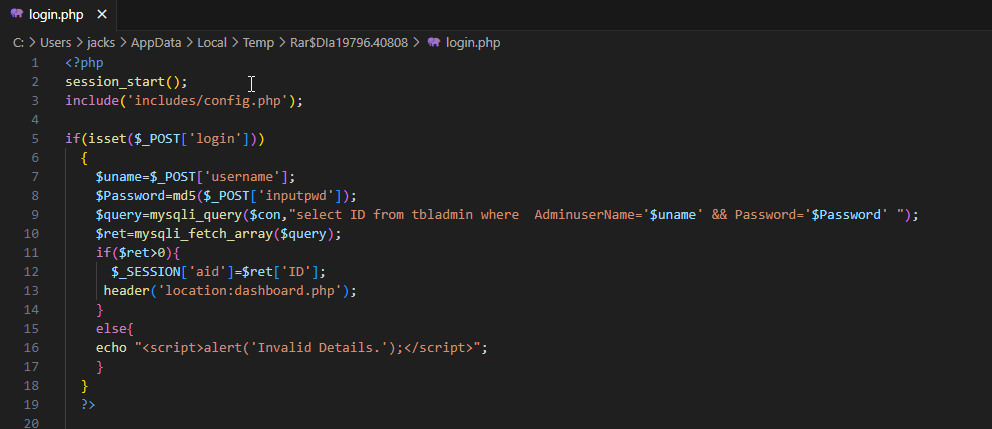

# Nipah virus (NiV) – Testing Management System Using PHP and MySQL 1.0 has a SQL injection vulnerability in login.php

# Software
* Software: Nipah virus (NiV) – Testing Management System Using PHP and MySQL 1.0
* Software Link: https://phpgurukul.com/nipah-virus-niv-testing-management-system-using-php-and-mysql/
* Vulnerability Type: SQL Injection
* Attack Type: Remote
* Vendor of Product: phpgurukul

# Description
A vulnerability has been found in Nipah virus (NiV) – Testing Management System Using PHP and MySQL 1.0 and classified as critical. Phpgurukul's Nipah virus (NiV) – Testing Management System Using PHP and MySQL 1.0 has a SQL injection vulnerability in login.php. The manipulation of the argument `username` leads to SQL injection. Remote attackers can leverage this vulnerability to manipulate a web application's SQL query by injecting malicious SQL code. This can lead to unauthorized access to databases, data theft, data manipulation, and other malicious activities.

# Vulnerability Code
* Login.php

